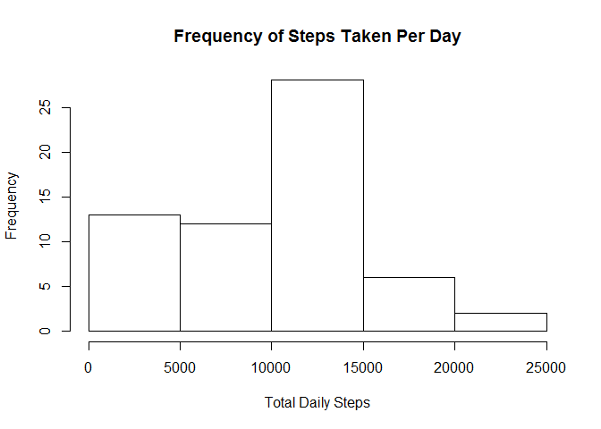
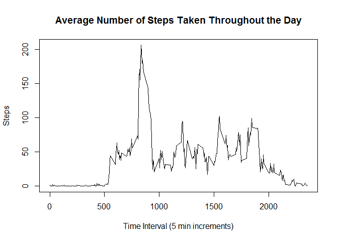
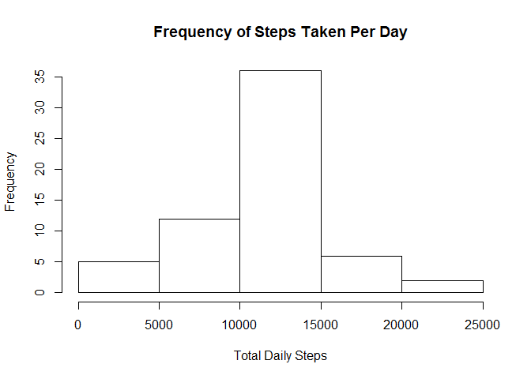
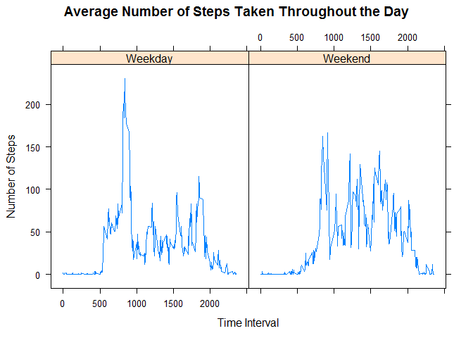

# Reproducible Research: Peer Assessment 1


## Loading and preprocessing the data
First we set the working directory to the repository directory that contains the zipped dataset. This is the code used to unzip the data and preprocess it into a table in R:


```r
unzip(zipfile = "activity.zip")
activity <- read.csv("activity.csv")
activity$date <- as.Date(activity$date)
```
## What is mean total number of steps taken per day?

We use the dplyr package to calculate the total number of steps taken per day, ignoring missing values.


```r
library(dplyr)
```

```
## 
## Attaching package: 'dplyr'
## 
## The following object is masked from 'package:stats':
## 
##     filter
## 
## The following objects are masked from 'package:base':
## 
##     intersect, setdiff, setequal, union
```

```r
totalSteps <- activity %>% group_by(date) %>% summarize(sum_steps = sum(steps, na.rm = TRUE))
totalSteps
```

```
## Source: local data frame [61 x 2]
## 
##          date sum_steps
## 1  2012-10-01         0
## 2  2012-10-02       126
## 3  2012-10-03     11352
## 4  2012-10-04     12116
## 5  2012-10-05     13294
## 6  2012-10-06     15420
## 7  2012-10-07     11015
## 8  2012-10-08         0
## 9  2012-10-09     12811
## 10 2012-10-10      9900
## ..        ...       ...
```

Here is a histogram that shows the frequency of total daily steps in buckets of 5000:


```r
hist(totalSteps$sum_steps, main = "Frequency of Steps Taken Per Day",xlab = "Total Daily Steps", ylab = "Frequency")
```

 

The median and mean number of steps taken per day is shown below using the summary function:


```r
summary(totalSteps$sum_steps)
```

```
##    Min. 1st Qu.  Median    Mean 3rd Qu.    Max. 
##       0    6778   10400    9354   12810   21190
```

## What is the average daily activity pattern?

Using the same dataset, we take the average of steps by grouping by time interval:


```r
patternSteps <- activity %>% group_by(interval) %>% summarize(average_steps = mean(steps, na.rm = TRUE))

plot(patternSteps, type = "l", main = "Average Number of Steps Taken Throughout the Day", xlab = "Time Interval (5 min increments)", ylab = "Steps")
```

 

The time interval that contains the highest average of steps can be computed as follows:


```r
patternSteps$interval[patternSteps$average_steps == max(patternSteps$average_steps)]
```

```
## [1] 835
```


## Imputing missing values

There are a lot of missing data points in the original dataset. The total number of missing values in the dataset can be found with the summary function:


```r
summary(activity$steps)
```

```
##    Min. 1st Qu.  Median    Mean 3rd Qu.    Max.    NA's 
##    0.00    0.00    0.00   37.38   12.00  806.00    2304
```

Let us use the interval average as the substitute for the missing data. We do this by copying the dataset and filling in, for each NA value, the average associated with its interval as calculated in the previous step.


```r
activity1 <- activity

for(i in seq_along(activity1$steps)){
    if(is.na(activity1$steps[i])){
        activity1$steps[i] <- patternSteps$average_steps[patternSteps$interval == activity1$interval[i]]
    }
}
```

For this new dataset we can compute the same sum, histogram and mean/median as in the first step.


```r
totalSteps1 <- activity1 %>% group_by(date) %>% summarize(sum_steps = sum(steps, na.rm = TRUE))
totalSteps1
```

```
## Source: local data frame [61 x 2]
## 
##          date sum_steps
## 1  2012-10-01  10766.19
## 2  2012-10-02    126.00
## 3  2012-10-03  11352.00
## 4  2012-10-04  12116.00
## 5  2012-10-05  13294.00
## 6  2012-10-06  15420.00
## 7  2012-10-07  11015.00
## 8  2012-10-08  10766.19
## 9  2012-10-09  12811.00
## 10 2012-10-10   9900.00
## ..        ...       ...
```

Here is a histogram that shows the frequency of total daily steps **in the modified dataset** in buckets of 5000:


```r
hist(totalSteps1$sum_steps, main = "Frequency of Steps Taken Per Day",xlab = "Total Daily Steps", ylab = "Frequency")
```

 

The median and mean number of steps **in the modified dataset** taken per day is shown below. It appears that our substitution method has inflated both the median and the mean, by increasing the amount of numbers being summed (for the mean) and the frequency of central numbers (for the median).


```r
summary(totalSteps1$sum_steps)
```

```
##    Min. 1st Qu.  Median    Mean 3rd Qu.    Max. 
##      41    9819   10770   10770   12810   21190
```


## Are there differences in activity patterns between weekdays and weekends?

We now categorize each date in the time series by weekday vs. weekend.

```r
activity1$weekend <- weekdays(activity1$date, abbreviate = TRUE)
for(i in seq_along(activity1$weekend)){
    if(activity1$weekend[i] %in% c("Sat","Sun")){
        activity1$weekend[i] <- "Weekend"
    }
    else(activity1$weekend[i] <- "Weekday")
}

activity1$weekend <- factor(activity1$weekend)
```

This enables us to compute interval averages across weekend and weekday categories, which we plot using the lattice graphic system below:


```r
patternSteps1 <- activity1 %>% group_by(weekend, interval) %>% summarize(average_steps = mean(steps, na.rm = TRUE))
library(lattice)
xyplot(average_steps ~ interval | weekend, data = patternSteps1,type = "l", ylab = "Number of Steps",xlab = "Time Interval", main = "Average Number of Steps Taken Throughout the Day")
```

 

It appears that the spike in steps taken in the morning on weekdays disappears on the weekend, while the overall level of activity increases throughout the day on weekends.
